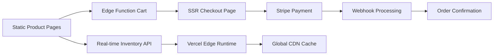

# Parisa London E-shop Architecture

## 🛍️ E-commerce Approaches with Astro.js

Since Astro is primarily a static site generator, we need to handle the dynamic e-commerce functionality strategically. Here are the recommended approaches:

---

## 🏆 **Production Architecture: Astro Hybrid + Vercel Serverless**

### **How it Works:**
1. **Astro hybrid rendering** - Static pages for content, SSR for dynamic features
2. **Vercel Edge Functions** for real-time inventory and cart management
3. **Stripe integration** with webhook processing for order management
4. **Global CDN delivery** for optimal performance worldwide

### **Architecture Flow:**



### **Technical Implementation:**

#### **1. Product Catalog (Static)**
```javascript
// src/data/products.json
{
  "kaleidoscope": [
    {
      "id": "k001",
      "name": "Rainbow Diamond Pendant",
      "price": 285000, // Price in pence (£2,850.00)
      "stripePrice": "price_1ABC123", // Stripe Price ID
      "images": ["/images/products/k001-1.jpg"],
      "description": "Exquisite pendant featuring rare diamonds",
      "inStock": true
    }
  ]
}
```

#### **2. Shopping Cart (Client-Side JavaScript)**
```javascript
// src/scripts/cart.js
class ShoppingCart {
  constructor() {
    this.items = JSON.parse(localStorage.getItem('cart') || '[]');
    this.updateCartUI();
  }

  addItem(productId, quantity = 1) {
    // Add product to cart
    this.items.push({ productId, quantity });
    this.saveCart();
    this.updateCartUI();
  }

  checkout() {
    // Redirect to Stripe Checkout with cart items
    const stripe = Stripe('pk_live_...');
    stripe.redirectToCheckout({
      lineItems: this.items.map(item => ({
        price: item.stripePrice,
        quantity: item.quantity
      })),
      mode: 'payment',
      successUrl: 'https://parisalondon.com/success',
      cancelUrl: 'https://parisalondon.com/cart'
    });
  }
}
```

#### **3. Product Pages (Astro Components)**
```astro
---
// src/pages/collections/kaleidoscope/[product].astro
import Layout from '../../../layouts/Layout.astro';
import { products } from '../../../data/products.json';

export async function getStaticPaths() {
  return products.kaleidoscope.map(product => ({
    params: { product: product.id },
    props: { product }
  }));
}

const { product } = Astro.props;
---

<Layout title={product.name}>
  <main>
    <h1>{product.name}</h1>
    <p>£{(product.price / 100).toFixed(2)}</p>
    
    <button 
      class="add-to-cart" 
      data-product-id={product.id}
      data-stripe-price={product.stripePrice}
    >
      Add to Cart - £{(product.price / 100).toFixed(2)}
    </button>
  </main>

  <script>
    import { cart } from '../../../scripts/cart.js';
    
    document.querySelector('.add-to-cart').addEventListener('click', (e) => {
      const productId = e.target.dataset.productId;
      const stripePrice = e.target.dataset.stripePrice;
      cart.addItem(productId, stripePrice);
    });
  </script>
</Layout>
```

---

## 💳 **Payment Flow Options**

### **Option 1: Stripe Checkout (Simplest)**
```javascript
// Direct redirect to Stripe-hosted checkout
const checkout = () => {
  window.location.href = `https://buy.stripe.com/...?client_reference_id=customer123`;
};
```

**Pros:** 
- ✅ No backend required
- ✅ PCI compliant automatically
- ✅ Supports all payment methods
- ✅ Mobile optimized

**Cons:**
- ❌ Less customization
- ❌ User leaves your site temporarily

### **Option 2: Stripe Payment Element (More Control)**
```javascript
// Embed Stripe payment form on your site
const stripe = Stripe('pk_live_...');
const elements = stripe.elements();
const paymentElement = elements.create('payment');
paymentElement.mount('#payment-element');
```

**Pros:**
- ✅ Users stay on your site
- ✅ More customization
- ✅ Better brand experience

**Cons:**
- ❌ Requires API endpoints (serverless functions)
- ❌ More complex implementation

---

## 🔧 **Production Astro Configuration**

### **1. Hybrid Mode Setup**
```javascript
// astro.config.mjs
import { defineConfig } from 'astro/config';
import vercel from '@astrojs/vercel/serverless';

export default defineConfig({
  output: 'hybrid', // Enable hybrid rendering
  adapter: vercel({
    edgeMiddleware: true // Enable Edge Functions
  }),
  integrations: [
    // Production integrations
  ],
  env: {
    schema: {
      STRIPE_PUBLISHABLE_KEY: envField.string({ context: "client", access: "public" }),
      STRIPE_SECRET_KEY: envField.string({ context: "server", access: "secret" })
    }
  }
});
```

### **2. Vercel Edge Functions**
```typescript
// src/pages/api/inventory/[productId].ts
export const config = {
  runtime: 'edge' // Sub-100ms global response
};

export async function GET({ params }) {
  const { productId } = params;
  
  // Check real-time inventory
  const inventory = await checkInventory(productId);
  
  return new Response(JSON.stringify({
    inStock: inventory.quantity > 0,
    quantity: inventory.quantity,
    lastUpdated: new Date().toISOString()
  }), {
    headers: {
      'Cache-Control': 'public, max-age=30' // 30-second cache
    }
  });
}
```

### **3. SSR Pages Configuration**
```astro
---
// src/pages/cart.astro
export const prerender = false; // Enable SSR for real-time cart

const cartItems = await getUserCart(Astro.cookies.get('session'));
const inventory = await Promise.all(
  cartItems.map(item => checkInventory(item.productId))
);
---

<Layout title="Shopping Cart">
  <CartComponent items={cartItems} inventory={inventory} />
</Layout>
```

---

## 🏪 **E-shop Features Implementation**

### **Core Shopping Features:**

#### **1. Product Catalog**
- ✅ **Static pages** generated from JSON data
- ✅ **Collection filtering** with client-side JavaScript
- ✅ **Search functionality** using Fuse.js
- ✅ **Product galleries** with image optimization

#### **2. Shopping Cart**
- ✅ **Add/remove items** with localStorage persistence
- ✅ **Cart drawer/modal** for quick access
- ✅ **Quantity updates** and price calculations
- ✅ **Cart abandonment** recovery via email

#### **3. Checkout Process**
- ✅ **Guest checkout** (no account required)
- ✅ **Multiple payment methods** via Stripe
- ✅ **Currency support** (GBP primary)
- ✅ **Mobile-optimized** checkout flow

#### **4. Order Management**
- ✅ **Order confirmations** via email
- ✅ **Receipt generation** through Stripe
- ✅ **Order tracking** integration possible
- ✅ **Customer notifications** automated

---

## 📱 **Mobile E-commerce Experience**

### **Progressive Web App Features:**
```javascript
// Add to cart with haptic feedback
const addToCart = (product) => {
  cart.add(product);
  
  // Haptic feedback on mobile
  if ('vibrate' in navigator) {
    navigator.vibrate(50);
  }
  
  // Visual feedback
  showToast('Added to cart!');
};
```


---

## 🚀 **Production Deployment on Vercel**

### **Deployment Configuration:**

#### **Vercel Project Setup**
```json
// vercel.json
{
  "buildCommand": "npm run build",
  "outputDirectory": "dist",
  "framework": "astro",
  "functions": {
    "src/pages/api/**/*.ts": {
      "runtime": "edge",
      "regions": ["lhr1", "fra1", "iad1"] // London, Frankfurt, Virginia
    }
  },
  "env": {
    "STRIPE_PUBLISHABLE_KEY": "@stripe-publishable-key",
    "STRIPE_SECRET_KEY": "@stripe-secret-key",
    "STRIPE_WEBHOOK_SECRET": "@stripe-webhook-secret"
  }
}
```

#### **Environment Variables (Production)**
- ✅ **Stripe keys** securely stored in Vercel dashboard
- ✅ **Database URL** for order management
- ✅ **Email service** credentials for notifications
- ✅ **Analytics tokens** for performance monitoring


---

## 💡 **Advanced E-commerce Features**

### **For Future Phases:**

#### **Inventory Management**
```javascript
// Real-time inventory checking
const checkStock = async (productId) => {
  const response = await fetch(`/api/inventory/${productId}`);
  const { inStock, quantity } = await response.json();
  return { inStock, quantity };
};
```

#### **Personalization**
```javascript
// Recently viewed products
const trackViewed = (productId) => {
  const viewed = JSON.parse(localStorage.getItem('recentlyViewed') || '[]');
  viewed.unshift(productId);
  localStorage.setItem('recentlyViewed', JSON.stringify(viewed.slice(0, 10)));
};
```

#### **Analytics Integration**
```javascript
// E-commerce tracking
gtag('event', 'purchase', {
  transaction_id: orderId,
  value: totalAmount,
  currency: 'GBP',
  items: cartItems
});
```

---

## 🎯 **Production Implementation Plan**

### **Phase 1: Hybrid Core Setup (Week 1)**
1. ✅ Configure Astro hybrid mode
2. ✅ Set up Vercel Edge Functions
3. ✅ Implement SSR cart and checkout pages
4. ✅ Deploy to Vercel staging environment

### **Phase 2: E-commerce Features (Week 2)**
1. ✅ Real-time inventory management via Edge Functions
2. ✅ Stripe webhook integration for order processing
3. ✅ Cart persistence across devices
4. ✅ Performance monitoring and analytics

### **Phase 3: Production Launch (Week 3)**
1. ✅ Domain configuration and SSL setup
2. ✅ Production environment variables
3. ✅ Load testing and optimization
4. ✅ Launch monitoring and support

### **Phase 4: Scaling & Enhancement (Month 2+)**
1. ✅ Advanced customer features
2. ✅ Email marketing automation
3. ✅ International shipping & currencies
4. ✅ Advanced analytics and reporting

---
---


1. **Inventory Management**:  manual JSON updates sufficient initiall.

2. **Customer Accounts**: guest checkout preferred for luxury purchases?

3. **Shipping**: fixed pricing for luxury items?


---

**Bottom Line**: Astro hybrid + Vercel serverless provides the perfect architecture for Parisa London's luxury e-commerce platform. The combination delivers lightning-fast static content with real-time dynamic features, optimal for boutique-level traffic while maintaining enterprise-grade scalability and performance.